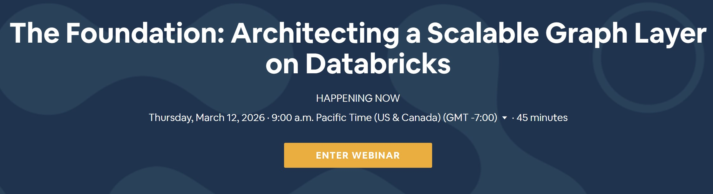

<h1 align="center">Neo4j: Architecting a Scalable Graph Layer on Databricks</h1>

<a href="https://www.bigmarker.com/neo4j/the-foundation-architecting-a-scalable-graph-layer-on-databricks?bmid=abd4eb06bbf5"></img></a>

## Description:
**The Foundation: Architecting a Scalable Graph Layer on Databricks:** Graphs are critical for understanding complex relationships, but building one from a Lakehouse requires more than just a script. In this session, we show how to architect a scalable graph layer using the Neo4j Spark Connector. Using a financial fraud use case, we demonstrate how to transform Databricks Bronze and Silver tables into a high-performance Neo4j graph model, setting the foundation for advanced analytics, feature engineering, and downstream AI workloads

## Notes:
#### Ryan Knight | [Neo4j](link)
- Sr Partner Architect, Neo4j
- Node Counts match source row counts. Relationship counts fall within expected, range for transaction volume. High-connectivity nodes reflect known patterns from source data. 
- Cycle Detection: fraud ring flags in the alerts table. pageRank: risk scores for investigation prioritization. 
- Community Detection: fraud ring groupings via Louvain.
- Degree Centrality: counterpart counts as ML Features
- Hallucination: plausible answers with no grounding in your data
- An LLM reads each chunks and extracts entities: regulations, thresholds, procedures
- GraphRAG: Graph-Enriched Retrieval. GraphRAG reaches graph data: grounded answers with entities and relatoinships from the konwledge graph
- Lakehouse holds the rest: transactions volumes, aggregations, trends in Delta Tables
- GraphRag can't computer SQL
- Context Window pollution: two schemas, two query languages, and two sets of conventions in one prompt dilutes focus
- Narrow Scope: an agent that only knows about graph strucutre writes graph queries; an agent that knows about both starts mixing them up
- Different reasoning patterns: SQL thinks in rows, filter, and aggregations: 
Cypher thinks in paths, patterns and tranversals
- Reliability: a generalist agent produces queirst that mix idioms. 

#### Will Jeffery | [Neo4j](link)
- Sr Solution Architect, Databricks
- Information here

#### Shyam Kathiresan | [Neo4j](link)
- Global Cloud Partnership Director
- 

## Resources:
- Neo4 has a document overview for [Cypher](https://neo4j.com/docs/cypher-manual/current/introduction/cypher-overview/):
    - **Cypher®** is Neo4j’s declarative graph query language. Graph Connectors and Integrations [here](https://neo4j.com/product/connectors/?utm_source=GSearch&utm_medium=PaidSearch&utm_campaign=CTAMER_CRSearch_SRNAWest_Non-Brand_DSA&utm_content=PCCoreDB_SCAura_Product&utm_term=&gad_source=1&gad_campaignid=20973570604&gbraid=0AAAAADk9OYru0-tsthdDN5YKtZiLRM8GK&gclid=CjwKCAjwyMnNBhBNEiwA-KcguzXD2M5NcFVn2WTOV6soHU-nlB8pECWDf_dhJUXCpJCOxN7efgxwHxoCzZwQAvD_BwE).

    - Intelligence platform: 
        - Data Layer: 
        - Knowledge Layer: 
        - Retrieval Layer: 
        - Agent Layer: 

## Contact:
<!--- You can add in your linkedin, medium, stack overflow, dev.to account, etc. here --->
If you want to contact me you can reach me at <nelson@oakhalo.com>.

Connect with me on <a href="https://www.linkedin.com/in/ayla-nelson/">LinkedIn</a>

Connect with me on <a href="https://github.com/oakHalo">Oakhalo.dev</a>

<!-- 
### TODO stx: 
Future Structure (stx):
backend
frontend
images
screenShots [contains video link]
troubleShooting [contains issues resolved]
-->
